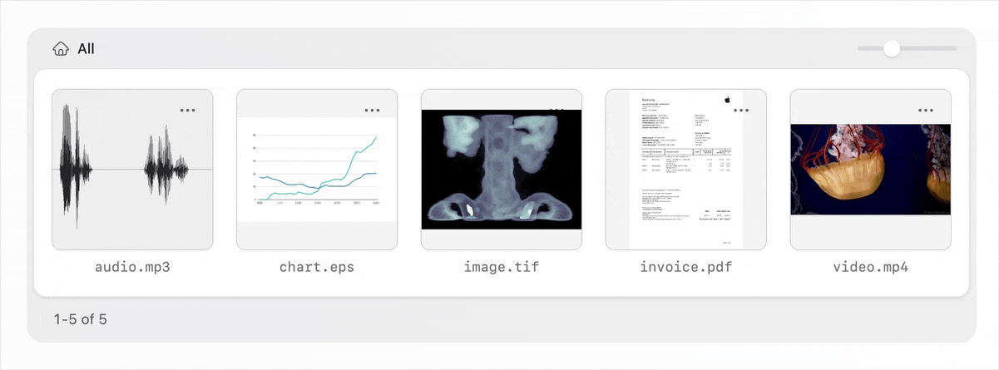

# Statamic Advanced Asset Thumbnails

**Generate asset thumbnails for exotic file formats like videos, raw photos, audio files and documents.**



> [!NOTE]
> Requires Statamic 6, which is currently in alpha, so the implementation might change and things
> could break at any time. Please report any issues you encounter.

## How It Works

The addon generates control panel thumbnails for non-image files by integrating with a
third-party file conversion service and caching the resulting image preview. Currently it
supports the following service. Support for CloudConvert is planned.

- [Transloadit](https://transloadit.com/): 9$/month, free tier available

## Quick Start

1. Install using `composer require daun/statamic-asset-thumbnails`
2. Configure the driver and credentials in `config/statamic/asset-thumbnails.php`
3. Any supported files will automatically get a thumbnail in the control panel

## File Formats

The Transloadit driver supports the following file formats:

- **Image**: tiff, bmp
- **Video**: mp4, mov, avi, mkv, webm, wmv
- **Audio**: mp3, aac, aif, m4a, off, opus, flac, wav
- **Raw Photo**: raw, dng, heic, heif, nef, nrw, cr2, cr3, crw
- **Document**: pdf, doc, docx, ppt, pptx, xls, xlsx, rtf, txt
- **Adobe**: psd, ai, eps

## Commands

You can clear the thumbnail cache using the following command:

```bash
php please thumbnails:clear
```

## Cache Disk

Thumbnails are cached in the `storage` folder and streamed from a controller to simplify setup.
If you define a custom disk inside the `public` folder, thumbnails can be served much faster by
redirecting to a public url instead.

Define a new disk in `config/filesystems.php`, then update the `cache.disk` option in the
addon's config file.

```php
'disks' => [
  'thumbnails' => [
    'driver' => 'local',
    'root' => storage_path('app/public/thumbnails'),
    'url' => env('APP_URL').'/storage/thumbnails',
    'visibility' => 'public',
  ],
],
```

## License

This addon is paid software with an open-source codebase. To use it in production, you'll need
to [buy a license](https://statamic.com/addons/daun/asset-thumbnails) from the Statamic Marketplace.
