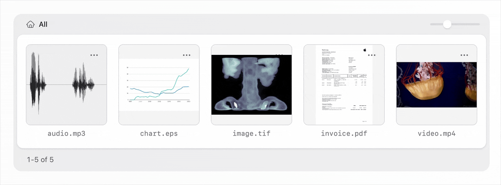

# Statamic Advanced Asset Thumbnails

**Generate asset thumbnails for exotic file formats like videos, raw photos, audio files and documents.**



## How It Works

The addon generates control panel thumbnails for non-image files by integrating with a
third-party file conversion service and download the resulting preview image.

## File Conversion Services

[Transloadit](https://transloadit.com/)  
9$/month for 5GB of uploads  
Free tier allows 5GB of uploads & adds watermarks to thumbnails

[CloudConvert](https://cloudconvert.com/)  
10€/month for 1000 uploads / 18€ once for 1000 credits  
Free tier allows 10 thumbnails per day

Transloadit supports a few more file formats and advanced customization. The most obvious
difference is audio files: Transloadit can generate thumbnails from wave forms or embedded
artwork, while CloudConvert does not support audio files at all.

## Quick Start

1. Install using `composer require daun/statamic-asset-thumbnails`
2. Configure the driver and credentials in `config/statamic/asset-thumbnails.php`
3. Any supported files will automatically get a thumbnail in the control panel
4. Recommended: set up a custom cache disk for faster thumbnail loading (see below for details)

## File Formats

Both drivers support the following file formats:

- **Image**: tiff, bmp
- **Video**: mp4, mov, avi, mkv, webm, wmv
- **Photo**: raw, dng, heic, heif, nef, cr2, cr3, crw
- **Document**: pdf, doc, docx, ppt, pptx, xls, xlsx, rtf, txt
- **Adobe**: psd, psb, eps

Transloadit supports a few additional formats:

- **Audio**: mp3, aac, aif, m4a, off, opus, flac, wav
- **Video**: h264
- **Adobe**: ai
- **Photo**: nrw, dcm

## Cache Disk

The default setup streams cached thumbnails from a custom controller. This simplifies initial setup,
but comes with some overhead. To make thumbnails load faster, you can define a custom disk inside
your app's `public` folder. Thumbnails can then be served directly from a public url, circumventing
Laravel entirely.

First, define a new disk in `config/filesystems.php`.

```diff
'disks' => [
+  'thumbnails' => [
+    'driver' => 'local',
+    'root' => storage_path('app/public/thumbnails'),
+    'url' => env('APP_URL').'/storage/thumbnails',
+    'visibility' => 'public',
+  ],
],
```

Then, update the cache disk in `config/statamic/asset-thumbnails.php`.

```diff
'cache' => [
-  'disk' => null,
+  'disk' => 'thumbnails',
],
```

## Commands

You can clear the thumbnail cache using the following command:

```bash
php please thumbnails:clear
```

## License

This addon is paid software with an open-source codebase. To use it in production, you'll need
to [buy a license](https://statamic.com/addons/daun/asset-thumbnails) from the Statamic Marketplace.
